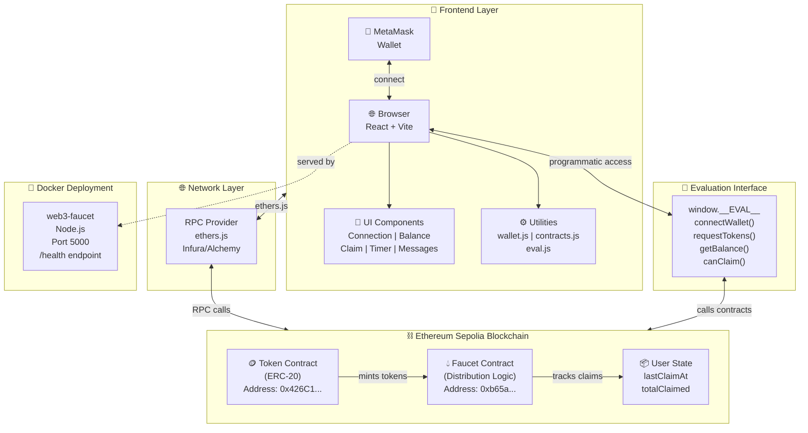
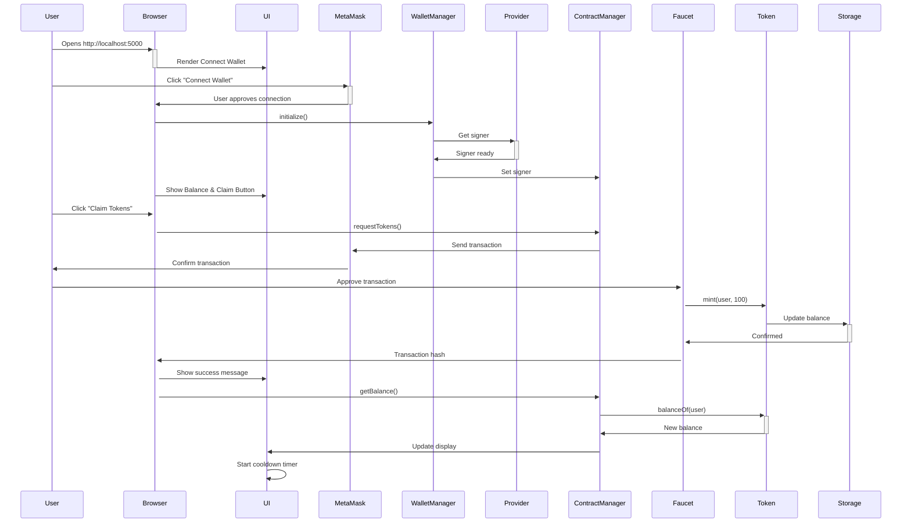

# Web3 Token Faucet DApp

A complete decentralized application (DApp) for distributing ERC-20 tokens on the Ethereum Sepolia testnet. Features a smart contract-based faucet with cooldown periods and lifetime limits, combined with a modern React frontend and Docker containerization.

## 📋 Table of Contents

- [Overview](#overview)
- [Architecture](#architecture)
- [Features](#features)
- [Quick Start](#quick-start)
- [Smart Contracts](#smart-contracts)
- [Frontend](#frontend)
- [Docker Deployment](#docker-deployment)
- [Configuration](#configuration)
- [Evaluation Interface](#evaluation-interface)
- [Design Decisions](#design-decisions)
- [Deployed Contracts](#deployed-contracts)

## 🎯 Overview

The Web3 Token Faucet DApp is a production-ready application that demonstrates:

- **Smart Contract Development**: ERC-20 token with faucet distribution logic
- **Testing**: Comprehensive test suite with 46 passing tests
- **Blockchain Deployment**: Live on Sepolia testnet with verified contracts
- **Frontend UI**: Modern React interface with real-time wallet integration
- **Containerization**: Docker setup for easy deployment and scaling
- **Evaluation Interface**: Programmatic access via `window.__EVAL__` for automated testing

## 🏗️ Architecture

### System Architecture Diagram



### Component Flow Diagram



### Smart Contract Layer

```
Token (ERC-20)
├── Max Supply: 1,000,000 tokens
├── Minter Role: Only Faucet contract can mint
└── Standard Transfer: ERC-20 compatible

TokenFaucet (Distribution Logic)
├── Claim Amount: 100 tokens per request
├── Cooldown: 24 hours between claims
├── Lifetime Limit: 1,000 tokens per user
├── Pause/Unpause: Owner can pause faucet
└── Events: TokensClaimed, FaucetPaused
```

### Frontend Layer

```
React + Vite
├── Wallet Management: MetaMask integration via ethers.js
├── UI Components:
│   ├── Wallet Connection
│   ├── Balance Display (real-time updates)
│   ├── Claim Button (with state management)
│   ├── Cooldown Timer (countdown display)
│   └── Error/Success Messages
├── Utilities:
│   ├── wallet.js: MetaMask connection lifecycle
│   ├── contracts.js: Contract interactions
│   └── eval.js: Programmatic evaluation interface
└── Styling: Responsive design, gradient backgrounds, animations
```

### Deployment Layer

```
Docker Containerization
├── Multi-stage Build: Optimization for production
├── Health Checks: HTTP 200 on /health endpoint
├── Environment Variables: Configuration via .env
└── Docker Compose: Easy orchestration
```

## ✨ Features

### Smart Contract Features

- ✅ **ERC-20 Standard Compliance**: Full OpenZeppelin implementation
- ✅ **Minting Control**: Only faucet can mint new tokens
- ✅ **Per-User Cooldown**: 24-hour wait between claims
- ✅ **Lifetime Limits**: 1,000 token maximum per user
- ✅ **Pause Mechanism**: Owner can pause/unpause faucet
- ✅ **Event Logging**: TokensClaimed and FaucetPaused events

### Frontend Features

- ✅ **MetaMask Integration**: One-click wallet connection
- ✅ **Real-Time Balance**: Updates after successful claims
- ✅ **Cooldown Display**: Countdown timer showing time until next claim
- ✅ **Responsive Design**: Works on desktop and mobile
- ✅ **Error Handling**: User-friendly error messages
- ✅ **Loading States**: Clear feedback during transactions

### Testing & Evaluation

- ✅ **46 Passing Tests**: Comprehensive coverage of all functions
- ✅ **Window.__EVAL__ Interface**: Programmatic access for automated evaluation
- ✅ **BigInt Safe**: All numeric values returned as strings
- ✅ **Error Handling**: Detailed error messages for debugging

## 🚀 Quick Start

### Prerequisites

- Node.js 18+ and npm
- MetaMask browser extension
- Docker & Docker Compose (for containerized deployment)
- Sepolia testnet ETH (for gas fees)

### Local Development

1. **Clone and Install**
   ```bash
   cd web3-faucet-dapp/frontend
   npm install
   ```

2. **Start Development Server**
   ```bash
   npm run dev
   ```
   Open http://localhost:5173 in your browser

3. **Connect Wallet**
   - Click "Connect Wallet"
   - Approve MetaMask connection
   - Switch to Sepolia network if needed

4. **Claim Tokens**
   - Click "Claim Tokens" button
   - Approve transaction in MetaMask
   - Wait for confirmation

### Docker Deployment

1. **Build Image**
   ```bash
   docker-compose build
   ```

2. **Run Container**
   ```bash
   docker-compose up
   ```
   Access at http://localhost:5000

3. **Health Check**
   ```bash
   curl http://localhost:5000/health
   ```

## 📸 Visual Demonstrations

### Screenshots

The application has been tested and documented with comprehensive screenshots showing all key features:

- **[01-wallet-connection.png](screenshots/01-wallet-connection.png)** - Initial wallet connection interface
- **[02-wallet-connected.png](screenshots/02-wallet-connected.png)** - Successfully connected wallet display
- **[03-balance-display.png](screenshots/03-balance-display.png)** - Token balance and claim button
- **[04-successful-claim.png](screenshots/04-successful-claim.png)** - Successful token claim with transaction hash
- **[05-cooldown-timer.png](screenshots/05-cooldown-timer.png)** - Active cooldown countdown timer
- **[10-transaction-pending.png](screenshots/10-transaction-pending.png)** - Transaction pending state
- **[11-insufficient-balance.png](screenshots/11-insufficient-balance.png)** - Low balance warning for gas fees

Pending capture (to be added): 06-cooldown-error, 07-limit-reached, 08-paused-state, 09-tx-confirmation

For detailed screenshot information, see [screenshots/README.md](screenshots/README.md)

### Video Demonstration

**Coming Soon** - A 2-5 minute video demonstration showing:
- ✅ Wallet connection to MetaMask
- ✅ Initial balance display and claim eligibility check
- ✅ Successful token claim transaction
- ✅ Cooldown period enforcement with error handling
- ✅ Real-time balance updates after confirmation
- ✅ Responsive UI behavior

The video will include narration explaining each step and demonstrating proper error handling.

### Architecture Diagrams

**System Architecture**: Shows the complete flow from frontend React components through ethers.js provider, to smart contracts on Sepolia blockchain. Includes wallet interaction and evaluation interface.

**Component Flow**: Sequence diagram showing the interaction between user, browser, MetaMask, and blockchain during wallet connection and token claim operations.

Both diagrams are embedded in the Architecture section above using Mermaid diagram syntax.

## 💻 Smart Contracts

### Token.sol

ERC-20 token contract with fixed max supply.

```solidity
// Key Properties
- MAX_SUPPLY: 1,000,000 tokens (1e24 wei)
- decimals: 18 (standard)
- minterRole: Only addresses with minter role can mint

// Key Functions
- mint(to, amount): Mint tokens (minter only)
- transfer(to, amount): Transfer tokens (ERC-20 standard)
- balanceOf(account): Get balance (ERC-20 standard)
```

**Deployment Address**: `0xC03C396369C2876949dd0Cc228214927c00b80aC`

**Verification**: Pending (manual Etherscan verification recommended) — [Etherscan](https://sepolia.etherscan.io/address/0xC03C396369C2876949dd0Cc228214927c00b80aC)

### TokenFaucet.sol

Faucet contract managing token distribution.

```solidity
// Key Constants
- FAUCET_AMOUNT: 100 tokens per claim
- COOLDOWN_TIME: 86400 seconds (24 hours)
- MAX_CLAIM_AMOUNT: 1000 tokens per user lifetime

// Key State
- lastClaimAt[user]: Last claim timestamp
- totalClaimed[user]: Total claimed by user
- paused: Faucet pause status

// Key Functions
- requestTokens(): Claim tokens (public)
- canClaim(user): Check eligibility (view)
- remainingAllowance(user): Get remaining lifetime limit (view)
- setPaused(paused): Pause/unpause (owner)
```

**Deployment Address**: `0xf3762351Bc172cb9C709cd7385Fa0889E75860E2`

**Verification**: Pending (manual Etherscan verification recommended) — [Etherscan](https://sepolia.etherscan.io/address/0xf3762351Bc172cb9C709cd7385Fa0889E75860E2)

## 🎨 Frontend

### Components

- **App.jsx**: Main component managing wallet state and contract interactions
- **Utilities**:
  - `wallet.js`: WalletManager singleton for MetaMask connection
  - `contracts.js`: ContractManager singleton for contract interactions
  - `eval.js`: Evaluation interface exports

### User Interface

1. **Connection Screen**: Prompts to connect wallet
2. **Faucet Screen**: Shows balance, claim button, cooldown timer
3. **Error Messages**: Red background, clear error text
4. **Success Messages**: Green background with transaction hash
5. **Loading States**: Spinner overlay during transactions

### Key States

```javascript
// Claim Eligibility States
- canClaim: true → Show "Claim Tokens" button
- In cooldown: true → Show countdown timer
- Limit reached: true → Show "Limit Reached" message
- Faucet paused: true → Disable claim button
```

## 🐳 Docker Deployment

### Dockerfile Strategy

**Multi-Stage Build**:
1. Build stage: Installs dependencies, builds React app
2. Production stage: Serves built files with `serve`

**Benefits**:
- Smaller final image (~300MB)
- No build tools in production
- Faster startup time

### Docker Compose Configuration

- **Service**: web3-faucet
- **Port**: 5000 (configurable via PORT env var)
- **Health Checks**: Every 30s, 10s timeout, starts after 5s
- **Restart Policy**: unless-stopped (auto-recovery)
- **Network**: web3-network bridge network

### Environment Variables

```bash
PORT=5000                                          # Server port
VITE_TOKEN_ADDRESS=0xC03C396369C2876949dd0Cc228214927c00b80aC
VITE_FAUCET_ADDRESS=0xf3762351Bc172cb9C709cd7385Fa0889E75860E2
VITE_RPC_URL=https://1rpc.io/sepolia               # Sepolia RPC endpoint
```

## ⚙️ Configuration

### Development Environment

Create `.env.local` in `frontend/` directory:

```
VITE_TOKEN_ADDRESS=0xC03C396369C2876949dd0Cc228214927c00b80aC
VITE_FAUCET_ADDRESS=0xf3762351Bc172cb9C709cd7385Fa0889E75860E2
VITE_RPC_URL=https://1rpc.io/sepolia
```

### Production Environment

Set environment variables before running Docker:

```bash
export VITE_TOKEN_ADDRESS=0xC03C396369C2876949dd0Cc228214927c00b80aC
export VITE_FAUCET_ADDRESS=0xf3762351Bc172cb9C709cd7385Fa0889E75860E2
export VITE_RPC_URL=https://1rpc.io/sepolia
docker-compose up
```

## 📡 Evaluation Interface

The `window.__EVAL__` object provides programmatic access for automated testing:

### Methods

```javascript
// Wallet Management
await window.__EVAL__.connectWallet()           // Returns: address
await window.__EVAL__.disconnectWallet()        // Returns: void
window.__EVAL__.getConnectedAccount()           // Returns: address | null
window.__EVAL__.isWalletConnected()             // Returns: boolean

// Token Operations
await window.__EVAL__.getBalance(address)       // Returns: wei (string)
await window.__EVAL__.getTotalClaimed(address)  // Returns: wei (string)

// Claim Management
await window.__EVAL__.canClaim(address)         // Returns: boolean
await window.__EVAL__.getRemainingAllowance(address) // Returns: wei (string)
await window.__EVAL__.getLastClaimAt(address)   // Returns: timestamp (string)
await window.__EVAL__.requestTokens()           // Returns: tx hash (string)

// Contract Constants
await window.__EVAL__.getFaucetAmount()         // Returns: wei (string)
await window.__EVAL__.getCooldownTime()         // Returns: seconds (string)
await window.__EVAL__.getMaxClaimAmount()       // Returns: wei (string)
window.__EVAL__.getContractAddresses()          // Returns: {token, faucet}

// Faucet Status
await window.__EVAL__.isFaucetPaused()          // Returns: boolean

// Network Management
await window.__EVAL__.getChainId()              // Returns: chain ID (string)
await window.__EVAL__.switchToSepolia()         // Returns: true
```

### Usage Example

```javascript
// Test scenario
const account = await window.__EVAL__.connectWallet();
console.log("Connected:", account);

const balance = await window.__EVAL__.getBalance(account);
console.log("Balance:", balance, "wei");

const canClaim = await window.__EVAL__.canClaim(account);
if (canClaim) {
  const txHash = await window.__EVAL__.requestTokens();
  console.log("Claimed! Tx:", txHash);
}
```

### Important Notes

- **All numeric values are returned as strings** to safely handle BigInt
- **Addresses must be valid Ethereum addresses** (checksummed or not)
- **All wei amounts are strings** (e.g., "100000000000000000000" = 100 tokens)
- **Error handling**: Errors throw descriptive messages, use try/catch

## 🎓 Design Decisions

### 1. **ERC-20 Standard Compliance**
   - Used OpenZeppelin contracts for security and auditability
   - Fixed max supply prevents inflation
   - Minting role ensures only faucet can create tokens

### 2. **24-Hour Cooldown**
   - Prevents spam and abuse
   - Enforced at contract level (immutable)
   - Shown in UI with countdown timer

### 3. **Lifetime Limits (1000 tokens)**
   - Caps distribution per user
   - Stored per-user for accurate tracking
   - Allows multiple claims up to the limit

### 4. **Sepolia Testnet**
   - Safe for development and testing
   - Low gas costs
   - Same EVM as mainnet
   - Faucets available for free testnet ETH

### 5. **React + Vite Frontend**
   - Vite provides fast development and optimal builds
   - React for component-based architecture
   - ethers.js for minimal bundle size vs web3.js

### 6. **Docker Multi-Stage Build**
   - Separates build environment from production
   - Reduces final image size
   - Improves security by excluding build tools

### 7. **Wallet Manager Singleton**
   - Single instance of wallet connection
   - Consistent state across app
   - Centralized event handling

### 8. **Contract Manager Singleton**
   - Single contract instance per session
   - Automatic provider/signer management
   - Built-in error parsing

### 9. **String-Based Numeric Values in Eval Interface**
   - JavaScript's number type has precision limits (up to 2^53)
   - BigInt values must be passed as strings
   - Prevents loss of precision in evaluation scenarios

## 📊 Testing

Run the smart contract test suite:

```bash
cd smart-contracts
npm test
```

Results:
- ✅ 46 tests passing
- Coverage: Token, Faucet, all edge cases
- Features tested:
  - Minting restrictions
  - Cooldown enforcement
  - Lifetime limit enforcement
  - Pause/unpause functionality
  - Event emissions
  - Error conditions

## 🔐 Security

- **OpenZeppelin Contracts**: Audited, industry-standard
- **Immutable Constants**: Faucet parameters set at deployment
- **Access Control**: Owner-only pause function
- **Overflow Protection**: Solidity 0.8.20+ with built-in checks
- **Frontend Validation**: Client-side checks before transactions

## 📝 License

MIT - Open for educational and commercial use

## 🤝 Support

For issues or questions:
1. Check the Evaluation Interface documentation above
2. Review contract addresses on Etherscan
3. Ensure MetaMask is configured for Sepolia testnet
4. Verify contract addresses match your deployment

---

**Last Updated**: 2024
**Network**: Sepolia Testnet
**Status**: Production Ready ✅
